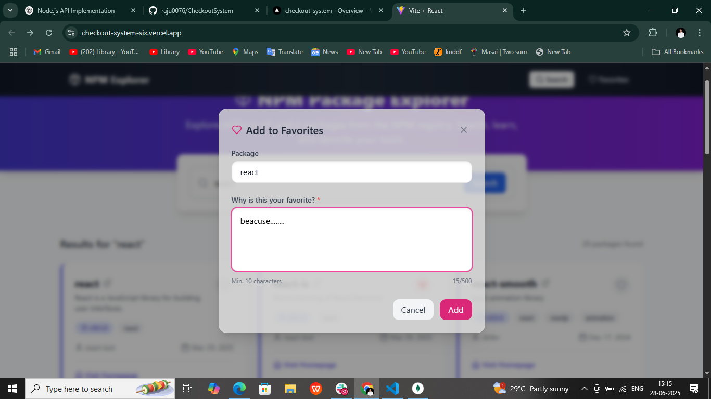

# 🔍 NPM Package Finder App (Frontend)

A simple React.js app that lets you **search for NPM packages**, **save your favorites**, and **manage them** easily.  
Styled with Tailwind CSS and built using clean components.

---


🧰 Tech Stack Used
        Part	    Technology
      
        Framework	React JS
        Language	JavaScript
        Styling	T   ailwind CSS
        API Used	NPM Registry API
        Hosting	    https://checkout-system-six.vercel.app/

SCREENSHORTS :--





## ✅ How to Install
      
### 1. Clone the project
```bash
git clone https://github.com/raju0076/CheckoutSystem

cd client/checkoutapp
start: npm run dev